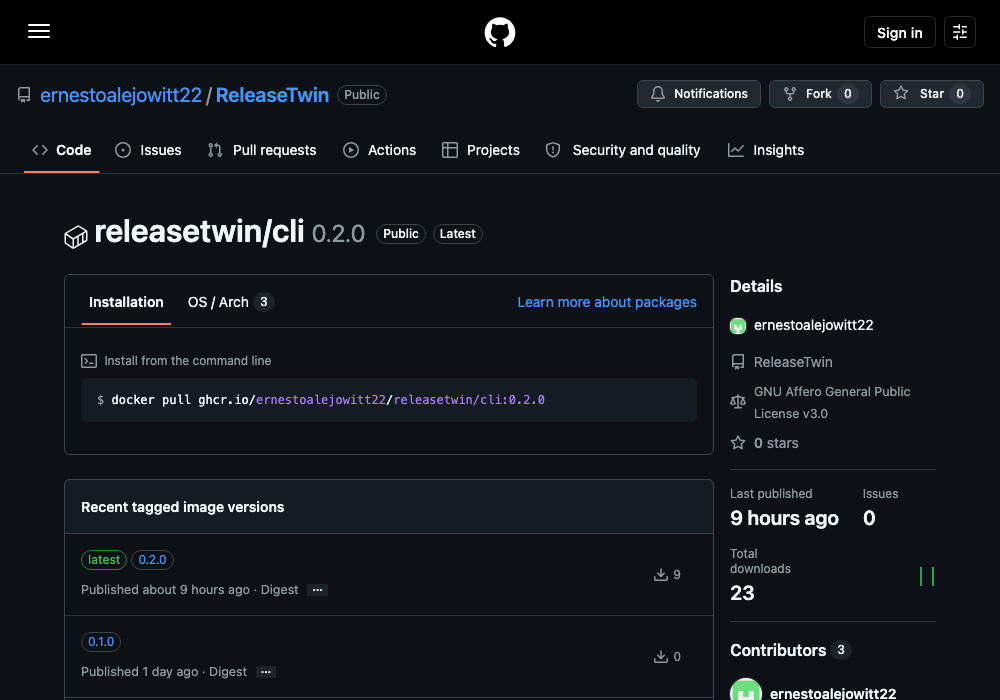
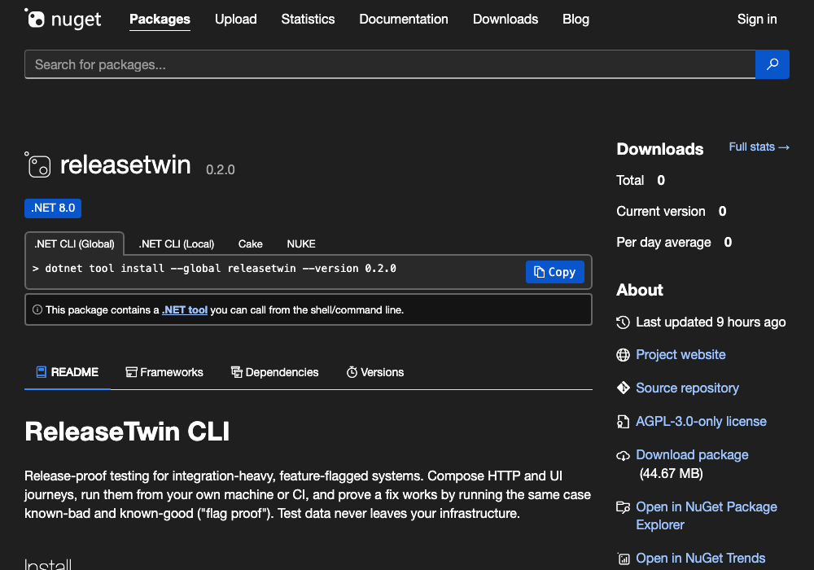
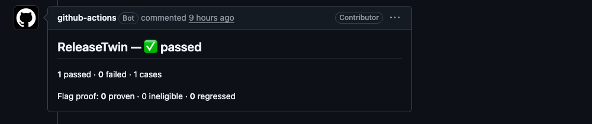
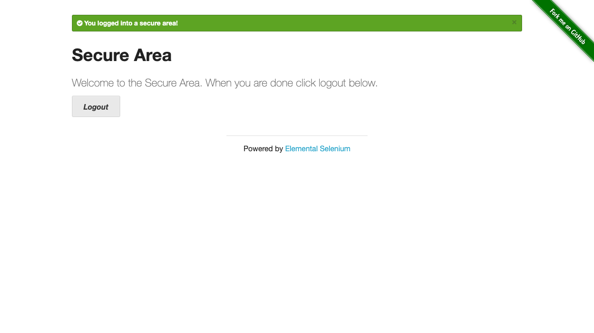
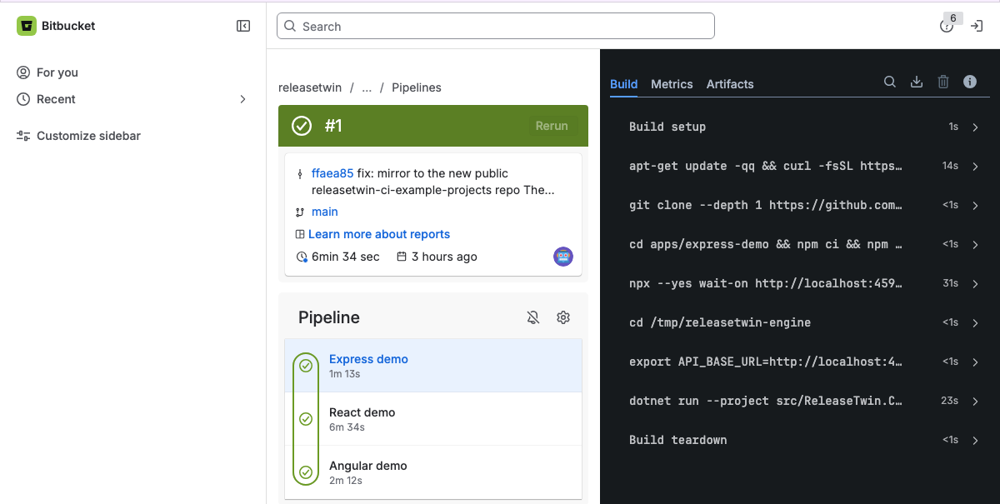

<!--
SPDX-FileCopyrightText: 2026 Ernesto Alejo and the ReleaseTwin contributors
SPDX-License-Identifier: AGPL-3.0-only WITH LicenseRef-ReleaseTwin-Adapter-Exception
-->

# ReleaseTwin in CI

The CLI exits non-zero on any case failure, so it drops into any pipeline as a required
check with no extra wiring. Three ways to get the CLI into a job:

```yaml
name: Release-proof gate
on: pull_request
jobs:
  release-proof:
    runs-on: ubuntu-latest
    steps:
      - uses: actions/checkout@v4

      # A — the container image (no .NET on the runner)
      - run: docker run --rm -v "$PWD:/workspace:ro"
          ghcr.io/ernestoalejowitt22/releasetwin/cli:0.2.0 /workspace/cases

      # B — the .NET global tool (the runner has .NET)
      # - run: dotnet tool install -g releasetwin --version 0.2.0
      # - run: releasetwin ./cases

      # C — the GitHub Action (adds a PR comment + check run) — see "PR annotations" below
```

Pin a released version (`cli:0.2.0`, `--version 0.2.0`, `@v0.2.0`) in CI. A non-zero exit
fails the job, fails the check, blocks the merge — the same gate you trust for unit tests.

Both packages are real and publicly pullable — screenshots below, captured
2026-09-03, are one-time snapshots; the linked pages are the current source of truth.

| A — the container image | B — the .NET global tool |
| --- | --- |
| [](https://github.com/ernestoalejowitt22/releasetwin/pkgs/container/releasetwin%2Fcli) | [](https://www.nuget.org/packages/releasetwin) |

## Machine-readable run summary

Pass `--summary-json <path>` (or set `RELEASETWIN_SUMMARY_JSON`) and the CLI writes a
versioned JSON summary of the run after it finishes — on pass or fail — alongside its
normal human output:

```jsonc
{
  "schemaVersion": 2,
  "overall": "failed",
  "totals": { "passed": 12, "failed": 1, "cases": 13 },
  "flagProof": { "proven": 3, "ineligible": 1, "regressed": 0 },
  "cases": [
    { "id": "HTTP-DEMO-1", "outcome": "passed", "classification": null, "flagProof": null, "release": "4.2" },
    { "id": "CLM-042", "outcome": "failed", "classification": "infrastructure", "flagProof": null, "release": null,
      "evidenceUrl": "https://app.releasetwin.com/dashboard/reports/…/evidence?projectId=…" }
  ],
  "runUrl": "https://app.releasetwin.com/dashboard?projectId=…"
}
```

It carries only metadata the CLI already prints — ids, outcomes, classifications,
flag-proof results, and the `release` label. No bodies, no secrets. With no flag set, no
file is written and behavior is unchanged.

`runUrl` (top level) and a case's `evidenceUrl` are **optional** and appear only when the run
uploaded to a hosted project (see Credentials) — `runUrl` links the project dashboard;
`evidenceUrl` is present for a case whose evidence was uploaded and accepted. A consumer
that ignores unknown fields is unaffected; a run with no upload produces a summary
identical to `schemaVersion: 1` apart from the version integer.

## PR annotations

`integrations/github-action/` is an open-source (Apache-2.0) GitHub Action that runs the
CLI with `--summary-json` and renders the summary onto the pull request:

- a **comment** — created once, updated in place on every re-run (keyed by a hidden
  marker) — with the totals, the flag-proof verdict, and a table of the notable cases
- a **check run** named `ReleaseTwin` with the same outcome, which you can make a required
  status check to block the merge

It uses only the workflow's `GITHUB_TOKEN` and GitHub's REST API — no ReleaseTwin account,
no hosted call.

A real one, from this repo's own dogfooded run
(`.github/workflows/pr-annotations.yml`, [PR #124](https://github.com/ernestoalejowitt22/ReleaseTwin/pull/124#issuecomment-5529871690)):



```yaml
permissions:
  contents: read
  pull-requests: write
  checks: write

jobs:
  release-proof:
    runs-on: ubuntu-latest
    steps:
      - uses: actions/checkout@v4
      - uses: ernestoalejowitt22/ReleaseTwin/integrations/github-action@v0.2.0
        with:
          cases-path: cases
          image: ghcr.io/ernestoalejowitt22/releasetwin/cli:0.2.0
```

Pin a full version (`@v0.2.0`) in CI. `@v0` is a floating tag that tracks the latest 0.x
release if you want patches automatically. The `image` input must be a publicly pullable
tag.

**Run-only gate** (no PR comment, just the check): pass `comment: false`. The `ReleaseTwin`
check run still reports pass/fail — make it a required status check on the protected branch
and that's your merge gate, no comment noise.

See [`integrations/github-action/README.md`](../integrations/github-action/README.md) for
every input. This repo dogfoods the Action in `.github/workflows/pr-annotations.yml`.

## What a failure looks like

Every screenshot on this page so far shows a pass. Here's a real failure, with real
evidence attached — not just text.
[`examples/cases-ui-journey/cases/example-ui-journey-demo-failure.yaml`](../examples/cases-ui-journey/cases/example-ui-journey-demo-failure.yaml)
is a permanent, intentional demo case: it logs into a real public test site (the same
one [`example-ui-journey.yaml`](../examples/cases-ui-journey/cases/example-ui-journey.yaml)
uses successfully), then asserts the post-login message equals text the page never
shows. The login is real; only the expected value is deliberately wrong — the same way a
regression test is deliberately written to fail until a fix lands.

```text
FAIL UI-JOURNEY-DEMO-FAILURE-1 (Product): element '#flash' text was 'You logged into a secure area!
×', expected exactly 'Welcome back, valid user!'
```



No hosted account was used to capture this — just `RELEASETWIN_EVIDENCE=on` and
`RELEASETWIN_EVIDENCE_DIR=<path>` (see Credentials, below), which writes each case's
redacted evidence document and screenshots straight to disk.

## Other CI platforms

The GitHub Action's PR comment + check run are GitHub-specific. Every other major CI
platform ingests **JUnit XML** natively, so `--junit-xml <path>` (or
`RELEASETWIN_JUNIT_XML`) gives you a native test view — a per-case table, history, and
merge-request annotations — with no ReleaseTwin package to install on those platforms.

```bash
releasetwin ./cases --junit-xml junit.xml
```

The report carries only what the CLI already prints — case ids, outcomes, failure
classifications, and flag-proof verdict names. No bodies, no headers, no secrets, even
when evidence capture is on. Written on pass or fail; nothing is written without the flag.

### Outcome mapping

| Run result | JUnit `<testcase>` |
|---|---|
| case passed · flag proof `Passed` | pass |
| case failed | `<failure>` (message = the failure classification) |
| flag proof `WeakOracle` / `BothFailed` / `Inverted` | `<failure>` (message = the verdict) |
| flag proof `Ineligible` / `ControlFailed` / `ControlUnverified` | `<failure>` (message = the verdict) |

There is no `skipped` state. A flag-proof case that asked for a paired run and did not
get one — `Ineligible` (no toggle mechanism), `ControlFailed`, `ControlUnverified` —
shows as a **failure** in the widget. This is deliberately stricter than the CLI's own
exit code, which does not fail a run on `Ineligible`: the widget answers "is this build
release-proven?", and a `flag_proof` case that never ran paired is not evidence. The full
nuance stays in `--summary-json` and the CLI's own output. If an environment legitimately
cannot perform flag proof, don't declare `flag_proof` on the cases that run there, or run
them in a separate job.

### GitLab

`integrations/gitlab-component/` is an Apache-2.0 GitLab CI/CD Component. Include it and
the merge-request test widget and pipeline **Tests** tab populate automatically from the
run — no GitLab API token, no ReleaseTwin account.

```yaml
include:
  - component: $CI_SERVER_FQDN/releasetwin/releasetwin/releasetwin@0.2.0
    inputs:
      cases-path: cases

stages:
  - test
```

The job exits non-zero on any case failure or adverse flag-proof verdict — make it a
required check on the protected branch. See
[`integrations/gitlab-component/README.md`](../integrations/gitlab-component/README.md)
for every input and the `remote:` include form for instances without the CI/CD Catalog.

### Bitbucket Pipelines

Bitbucket collects test results from any `**/test-results/*.xml` (or `**/junit.xml`) it
finds after a step — no configuration key needed.

```yaml
pipelines:
  pull-requests:
    '**':
      - step:
          name: Release-proof gate
          image: ghcr.io/ernestoalejowitt22/releasetwin/cli:0.2.0
          script:
            - dotnet /app/ReleaseTwin.Cli.dll ./cases --junit-xml test-results/junit.xml
```

### CircleCI

```yaml
jobs:
  release-proof:
    docker:
      - image: ghcr.io/ernestoalejowitt22/releasetwin/cli:0.2.0
    steps:
      - checkout
      - run: dotnet /app/ReleaseTwin.Cli.dll ./cases --junit-xml /tmp/test-results/junit.xml
      - store_test_results:
          path: /tmp/test-results
```

### Azure Pipelines

```yaml
steps:
  - script: dotnet /app/ReleaseTwin.Cli.dll ./cases --junit-xml $(Build.ArtifactStagingDirectory)/junit.xml
    displayName: Release-proof gate
  - task: PublishTestResults@2
    condition: always()
    inputs:
      testResultsFormat: JUnit
      testResultsFiles: '$(Build.ArtifactStagingDirectory)/junit.xml'
```

(Run the `script` step inside a container job with the CLI image, or install the CLI as a
`dotnet` global tool first — see options B/C above.)

**These aren't just typed — Bitbucket is proven live.**
[`releasetwin-ci-examples`](https://github.com/ernestoalejowitt22/releasetwin-ci-examples)
runs three real demo apps (Express, React, Angular) through real CI platforms on every
push, mirrored to
[`releasetwin-ci-example-projects`](https://bitbucket.org/releasetwin/releasetwin-ci-example-projects)
on Bitbucket. **Bitbucket Pipelines**: verified green —
[build #1](https://bitbucket.org/releasetwin/releasetwin-ci-example-projects/pipelines/results/1).
**Azure Pipelines**: also verified green —
[build #239](https://ernestotesting.visualstudio.com/My%20First%20Project/_build/results?buildId=239)
(all three jobs — Express, React, Angular — passed), built directly from the GitHub repo via
a service connection, no mirror needed.

<!-- feature-proof-showcase / ci-docs-portability-screenshots: screenshots below are
     point-in-time captures from 2026-09-03 — the linked build pages above stay the
     source of truth if they ever disagree. -->

| Bitbucket Pipelines — build #1 | Azure Pipelines — build #239 |
| --- | --- |
| [](https://bitbucket.org/releasetwin/releasetwin-ci-example-projects/pipelines/results/1) | [](https://ernestotesting.visualstudio.com/My%20First%20Project/_build/results?buildId=239) |

Jenkins consumes the same file with the built-in `junit 'junit.xml'` step.

## Credentials

- HTTP-only cases need nothing.
- A flag-proof leg needs its flag source's credentials as job env
  (`LAUNCHDARKLY_API_TOKEN`, the `AZDO_*` set, …); pass them via the Action's `env-vars` or
  `env-file` input.
- To also land run history + evidence on the hosted dashboard, set `RELEASETWIN_API_TOKEN`
  and `RELEASETWIN_API_URL`. This additionally turns the PR annotation into a link into the
  dashboard — a "View run" link in the comment and check, and a per-case link to the
  evidence for any case whose evidence was uploaded and accepted.
- No hosted account needed to get evidence at all: set `RELEASETWIN_EVIDENCE=on` and
  `RELEASETWIN_EVIDENCE_DIR=<path>` and each case's redacted evidence (screenshots and
  action log, from any `ui.*` steps) is written to `<path>/<case-id>/` — a CI artifact you
  can upload with the platform's own artifact-upload step. Works with or without
  `RELEASETWIN_API_TOKEN`; set both to get evidence in both places.
